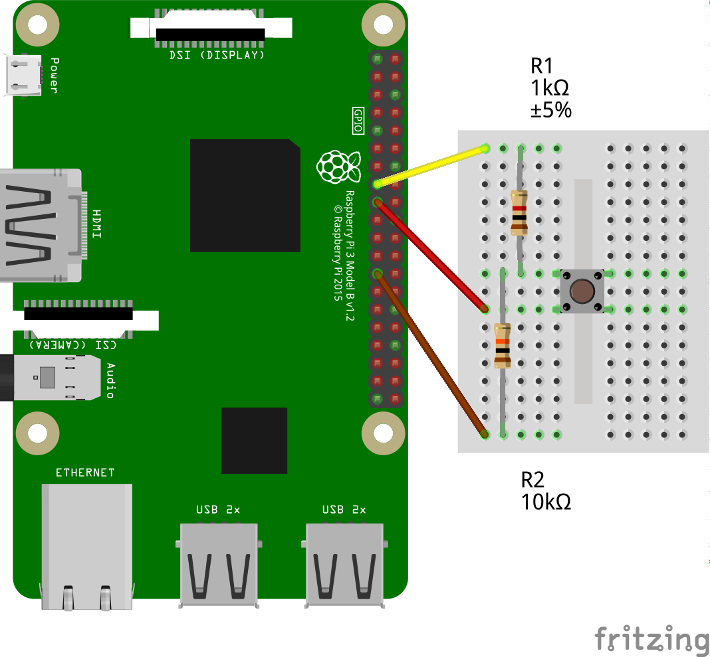

# rpicom-telegram
A Telegram based voice comunicator for Raspberry Pi.

## Overview
rpicom-telegram was created to provide communication via audio message exchange between a raspberry pi and a Telegram client app.

The raspberry must be equipped with a microphone, speaker and a pushbutton with connection scheme via GPIO. On the raspberry side, a nodejs framework (telegraf) is run to access the Telegram bot API, while on the client side, any Telegram application that can record and listen to audio messages can be used. Ex: Official Telegram App, Web Telegram, etc.

Notes:
- This app was only tested on a raspberry pi 3.
- I'm not a professional developer. I've written this app trying to get involved in the fundamentals node/javascript.

## Setup
### Mount the button circuit
Needed parts:
- One Push Button (normally open)
- One 1k ohm resistor
- One 10k ohm resistor
- Protoboard and jumpers

Check the circuit scheme:


- Yellow cable goes to pin 15 (GPIO22)
- Red cable goes to pin 17 (3.3V Power)
- Brow cable goest to pin 25 (GND)

Check the [rpi doc page](https://www.raspberrypi.org/documentation/usage/gpio/) for more details on GPIO numbers.

Optionally, you can fake the button presses by setting the MOCK_BUTTON=true env. Then, the 'a' key will simulate the 'press' and the 'b' will 'release'. Check the `.env.example` for details.

### Telegram BOT
Create a bot Telegram via [@botfather](https://telegram.me/BotFather) and save the generated token. Send any message to the bot you created, so the bot now has permission to send back new messages.

### Docker
Install docker on the raspberry:<br>
https://docs.docker.com/engine/install/debian/#install-using-the-convenience-script

Optionally, you can run the app without the docker, but you will have to install dependencies manually: nodejs (14+), opus-tools, alsa-utils and git clone project.

### Get app image
Pull the image with docker command:
```
sudo docker pull ssjeanderson/rpicom-telegram
```

Or, git clone this project and build locally:
```
git clone https://github.com/ssjeanderson/rpicom-telegram.git
cd rpicom-telegram
sudo docker build -t ssjeanderson/rpicom-telegram .
```

### App settings
The app's settings are made via the `.env` file. You will need to inform:
- Bot's Token
- Chat ID
- Button number
- Mic and speaker addresses. You can get these addresses by issuing `arecord -l` and `aplay -l` commands from the alsa-utils package. Check this [tutorial](https://en.wikibooks.org/wiki/Configuring_Sound_on_Linux/HW_Address) for more information.

There is an `.env.example` to be used as example. Check it's contents to see more information.

### Run App

Finally, run the container with the below options to grant permissions access to the hardware devices:
```
sudo docker run --name rpicom-telegram --env-file .env --device /dev/snd --privileged -d ssjeanderson/rpicom-telegram
```

## Operation
To send a voice message to the raspberry and play it, just send it to the bot in the traditional way and the message you be played automatically.

To send a voice message from the raspberry, push the button, speak while holding it, and when finished, release button, and the message will be sent to the destination on the chat id.